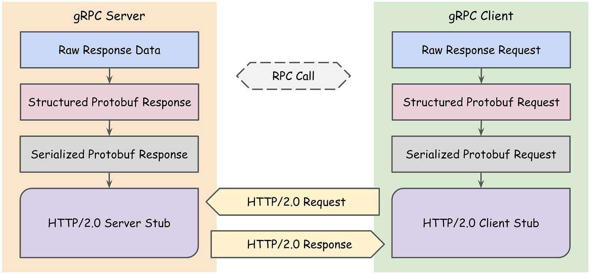
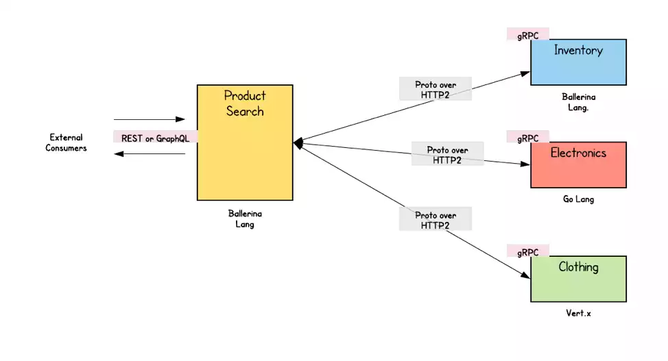
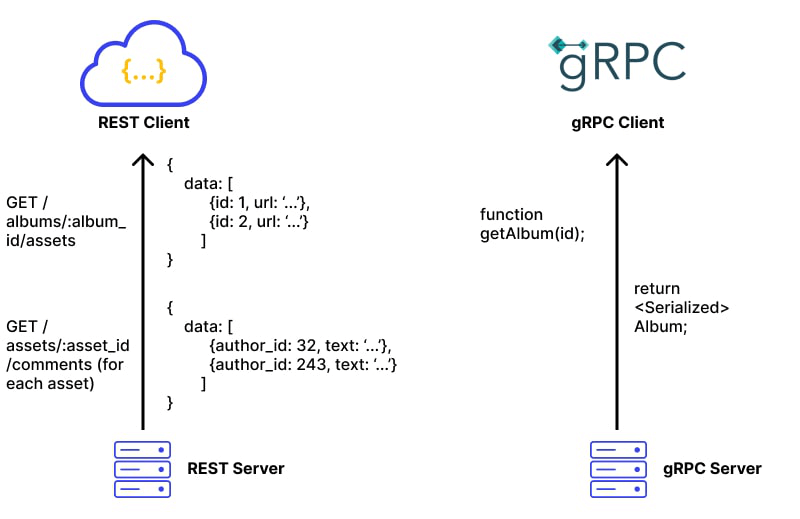

# De voordelen van gRPC in microservice-architecturen

## Inleiding
In de wereld van softwareontwikkeling en DevOps zijn microservices een populaire architecturale stijl geworden. Deze aanpak maakt het mogelijk om complexe applicaties te bouwen door ze op te splitsen in kleinere, onafhankelijke diensten. In een DevOps-omgeving biedt dit voordelen, zoals snellere iteraties, verbeterde schaalbaarheid en gemakkelijker beheer. Maar hoe communiceren deze microservices met elkaar? Hier komt gRPC om de hoek kijken. Deze blog verkent de voordelen van gRPC binnen microservice-architecturen in vergelijking met andere communicatiestandaarden, zoals REST, en hoe dit past binnen de DevOps-cultuur van snelle, efficiënte service-interactie en geautomatiseerde processen.


## gRPC
gRPC, ontwikkeld door Google, is een open-source framework voor Remote Procedure Calls (RPC) en wordt door veel grote organisaties gebruikt vanwege de hoge efficiëntie. Het maakt gebruik van Protocol Buffers (protobuf) als interface-definitietaal. Protobuf is een lichtgewicht en efficiënt gegevensserialisatieformaat dat de structuur van gegevens definieert in een eenvoudig leesbaar formaat, waardoor gegevens snel kunnen worden verzonden en ontvangen. Dit maakt gRPC een veelzijdige keuze voor ontwikkelaars, omdat het datacommunicatie in meerdere programmeertalen ondersteunt (About gRPC, n.d.).

Bedrijven zoals Square en Netflix hebben de overstap naar gRPC gemaakt, en benadrukken de verbeterde prestaties, eenvoud van integratie en de mogelijkheid om complexe systemen efficiënter te beheren (Pankaj, 2023).


Figuur 1: <ins>Netflix gebruikt gRPC in hun architectuur</ins>.

Een van de belangrijkste kenmerken van gRPC is het gebruik van HTTP/2, dat aanzienlijke verbeteringen biedt ten opzichte van HTTP/1.1. HTTP/2 ondersteunt multiplexing, waardoor meerdere verzoeken gelijktijdig over dezelfde verbinding kunnen worden verzonden, wat de latentie vermindert en de efficiëntie van de communicatie verhoogt. HTTP/2 biedt daarnaast server push-functionaliteit, waardoor data vooraf kan worden verzonden, wat leidt tot verdere prestatieverbeteringen (Introduction to gRPC, 2024).



Figuur 2: <ins>Overzicht van de werking van http2</ins>.

Daarnaast ondersteunt gRPC verschillende communicatiestijlen, waaronder eenvoudige aanroepen en bidirectionele streaming, wat het bijzonder geschikt maakt voor microservices-architecturen waarin diensten effectief met elkaar moeten communiceren.



Figuur 3: <ins>Voorbeeld gebruik van gRPC in een microservice</ins>.


## gRPC vs. REST
Om de voordelen van gRPC volledig te begrijpen, is het belangrijk om de traditionele REST-architectuur te bekijken. REST (Representational State Transfer) is een populaire API voor netwerkgebaseerde applicaties die gebruikmaakt van standaard HTTP-methoden zoals GET, POST, PUT en DELETE. Deze methoden worden gebruikt om resources te manipuleren, die geïdentificeerd worden door URI's (Uniform Resource Identifiers). RESTful API’s zijn stateless, wat betekent dat elke aanvraag onafhankelijk is en alle benodigde informatie bevat om het verzoek af te handelen. Hierdoor zijn RESTful API's breed toepasbaar en eenvoudig te implementeren. JSON en XML worden vaak gebruikt om gegevens over te dragen tussen client en server via HTTP-verzoeken en -antwoorden, wat zorgt voor een goed gestructureerde en begrijpelijke gegevensuitwisseling (gRPC vs REST - Difference Between Application Designs - AWS, n.d.).



Figuur 4: <ins>REST vs. gRPC</ins>.

Echter, in microservices-architecturen waar snelheid en efficiëntie cruciaal zijn, biedt gRPC vaak betere prestaties dan REST. Dit komt doordat gRPC gebruikmaakt van Protocol Buffers (Protobuf) om gegevens in een binair formaat te serialiseren in plaats van in tekstgebaseerde formaten zoals JSON. Deze binaire codering resulteert in kleinere berichten die sneller kunnen worden verzonden en minder verwerkingstijd vereisen aan beide zijden van de communicatie. Dit verschil in efficiëntie wordt nog duidelijker bij toepassingen met hoge prestaties en lage latentie, zoals real-time communicatiesystemen en data-intensieve microservices (Pankaj, 2023).

### Overeenkomsten tussen gRPC en REST
Hoewel gRPC en REST duidelijke verschillen hebben, delen ze ook enkele belangrijke overeenkomsten. Beide volgen de client-serverarchitectuur, waarbij clients verzoeken sturen en servers antwoorden. Ze maken beide gebruik van HTTP als het onderliggende transportprotocol, hoewel REST doorgaans gebruikmaakt van HTTP/1.1 en gRPC gebruikmaakt van het modernere HTTP/2. Bovendien zijn beide architecturen taalagnostisch, wat betekent dat ze kunnen worden geïmplementeerd in verschillende programmeertalen en dus een brede compatibiliteit bieden. Zowel gRPC als REST zijn ontworpen om stateless te zijn, wat inhoudt dat elke aanvraag alle informatie bevat die nodig is voor de verwerking, zonder dat de server eerdere aanvragen hoeft te onthouden.

### Verschillen tussen gRPC en REST
Ondanks hun overeenkomsten verschillen gRPC en REST fundamenteel in hun architectonisch ontwerp en implementatie. De belangrijkste verschillen zijn als volgt:

1. **Gegevensformaat**: REST maakt doorgaans gebruik van tekstgebaseerde gegevensformaten zoals JSON en XML, die eenvoudig leesbaar zijn, maar relatief omvangrijk en minder efficiënt qua prestaties. Daarentegen gebruikt gRPC Protocol Buffers (Protobuf), een binair gegevensserialisatieformaat dat veel compacter is en daarom sneller kan worden verzonden en verwerkt. Dit maakt gRPC bijzonder geschikt voor omgevingen waar bandbreedte of prestaties cruciaal zijn.

2. **Gegevensvalidatie**: Bij gRPC worden services en berichttypen gedefinieerd met behulp van Protobuf, waardoor automatische validatie van berichten mogelijk is. Dit zorgt ervoor dat de geserialiseerde gegevens aan specifieke structuurvereisten voldoen voordat ze worden verzonden. REST daarentegen vereist extra validatiestappen, bijvoorbeeld het handmatig controleren van JSON-objecten, wat meer verwerkingstijd en extra logica vereist aan zowel de client- als serverzijde.

3. **Communicatiepatronen**: REST volgt een traditioneel request-response-model, waarbij de client een verzoek doet en de server een enkel antwoord terugstuurt. gRPC daarentegen ondersteunt een breder scala aan communicatiepatronen dankzij het gebruik van HTTP/2, waaronder bidirectionele streaming, waarbij zowel de client als de server meerdere berichten kunnen uitwisselen over dezelfde verbinding. Dit maakt gRPC veel flexibeler en efficiënter voor toepassingen die real-time interactie vereisen, zoals live video- of audio-applicaties, maar ook voor scenario's waarin continue data-uitwisseling essentieel is, zoals in IoT-systemen.

4. **Ontwerppatroon**: In REST-gebaseerde architecturen wordt een resource-georiënteerd ontwerp gevolgd, waarbij resources worden geïdentificeerd en gemanipuleerd via URI's en HTTP-methoden. Dit betekent dat de nadruk ligt op het manipuleren van statische resources. In tegenstelling hiermee definieert gRPC APIs oproepbare functies op de server, wat lijkt op een Remote Procedure Call-model (RPC). In dit model roept de client direct functies aan op de server alsof ze lokaal worden uitgevoerd, wat een natuurlijkere benadering kan zijn voor diensten die nauw samenwerken.

5. **Codegeneratie**: gRPC maakt gebruik van Protobuf om API's te definiëren, wat niet alleen het berichtformaat specificeert, maar ook de service-methoden. Dit stelt ontwikkelaars in staat om automatisch client- en servercode te genereren in meerdere programmeertalen, wat de ontwikkelcyclus aanzienlijk versnelt. REST biedt deze ondersteuning niet standaard, en ontwikkelaars moeten handmatig code schrijven of andere frameworks gebruiken om dezelfde functionaliteit te bereiken.


## gRPC in microservices
gRPC biedt hoge prestaties, lage latentie en krachtige communicatiemogelijkheden, waardoor het ideaal is voor microservices-architecturen. Dankzij ondersteuning voor multiplexing, waarbij meerdere verzoeken en antwoorden gelijktijdig over dezelfde verbinding kunnen worden verzonden, vermindert het de overhead van verbindingen en verhoogt het de snelheid van communicatie aanzienlijk. Dit is vooral waardevol in omgevingen met veel onderlinge microservices die continu moeten communiceren.

### Keuze tussen REST en gRPC in microservices
Bij het maken van de keuze tussen REST en gRPC binnen een microservices-architectuur, is het cruciaal om naar de specifieke behoeften van de toepassing te kijken. REST is geschikt voor eenvoudigere microservices, vooral wanneer interoperabiliteit tussen systemen belangrijk is. Het wordt vaak gekozen vanwege de eenvoud en brede ondersteuning.

Wanneer efficiëntie, lage latentie, en prestaties echter prioriteiten zijn, biedt gRPC aanzienlijke voordelen. Het is bijzonder geschikt voor omgevingen waarin real-time interactie vereist is, zoals bij chat- of videodiensten, en in systemen die grote hoeveelheden gegevens verwerken, zoals IoT-platforms. Dankzij de binaire serialisatie en bidirectionele streaming optimaliseert gRPC de communicatie tussen diensten en vermindert het de overhead.

Daarnaast helpt gRPC’s automatische codegeneratie ontwikkelaars om sneller te werken en vermindert het het risico op fouten. Dit is vooral nuttig in grote, complexe microservices-omgevingen waarin consistentie en foutvermindering essentieel zijn.

Kortom, REST is een solide keuze voor eenvoudige en publieke API’s, terwijl gRPC de voorkeur verdient voor meer complexe, grootschalige microservices die hoge efficiëntie en real-time communicatie vereisen. De keuze tussen gRPC en REST hangt af van de specifieke prestatie-eisen, schaalbaarheid en flexibiliteit van je API.


## Stapsgewijze implementatie van gRPC in Node.js

### Voorbereiding

1. **Installeer Node.js**:
   Zorg ervoor dat Node.js is geïnstalleerd op je machine.

```bash
   node --version
```

2. **Maak een projectmap: Maak een nieuwe map en navigeer ernaartoe**:

```bash
mkdir grpc-quickstart
cd grpc-quickstart
```

3. **Initialiseer een nieuw npm-project: Gebruik npm om een nieuw project aan te maken**:

```bash
npm init -y
```

4. **Installeer de benodigde dependencies: Installeer de gRPC-bibliotheken en Proto loader**:

```bash
npm install @grpc/grpc-js @grpc/proto-loader
```

### Proto-bestand

**Maak een nieuw bestand genaamd helloworld.proto met de volgende inhoud**:

```proto
syntax = "proto3";

package helloworld;

service Greeter {
  rpc SayHello (HelloRequest) returns (HelloReply) {}
}

message HelloRequest {
  string name = 1;
}

message HelloReply {
  string message = 1;
}
```

### Server-implementatie
1. **Maak een bestand server.js en implementeer de gRPC-server**:

```javascript
const grpc = require('@grpc/grpc-js');
const protoLoader = require('@grpc/proto-loader');
const packageDefinition = protoLoader.loadSync('helloworld.proto');
const helloProto = grpc.loadPackageDefinition(packageDefinition).helloworld;

function sayHello(call, callback) {
  callback(null, { message: 'Hello ' + call.request.name });
}

function main() {
  const server = new grpc.Server();
  server.addService(helloProto.Greeter.service, { sayHello: sayHello });
  server.bindAsync('0.0.0.0:50051', grpc.ServerCredentials.createInsecure(), () => {
    console.log('Server running at http://0.0.0.0:50051');
    server.start();
  });
}

main();
```

2. **Start de gRPC-server**:

```bash
node server.js
```
### Client-implementatie

1. **Maak een nieuw bestand client.js en implementeer de gRPC-client**:

```javascript
const grpc = require('@grpc/grpc-js');
const protoLoader = require('@grpc/proto-loader');
const packageDefinition = protoLoader.loadSync('helloworld.proto');
const helloProto = grpc.loadPackageDefinition(packageDefinition).helloworld;

function main() {
  const client = new helloProto.Greeter('localhost:50051', grpc.credentials.createInsecure());
  client.sayHello({ name: 'World' }, (err, response) => {
    if (!err) {
      console.log('Greeting:', response.message);
    }
  });
}

main();
```

2. **Start de gRPC-client**:

```bash
node client.js`
```

Met deze stappen heb je een functionerende gRPC-server en client opgezet in Node.js.


## Conclusie
gRPC biedt aanzienlijke voordelen binnen microservice-architecturen, met name op het gebied van prestaties en efficiëntie. Dankzij de ondersteuning voor binaire communicatie via Protocol Buffers, en de voordelen van HTTP/2 zoals multiplexing en bidirectionele streaming, stelt gRPC ontwikkelaars in staat om systemen te bouwen die sneller en schaalbaarder zijn dan traditionele REST-oplossingen. Hoewel REST een bewezen en populaire keuze blijft, laat gRPC zien dat het, vooral in omgevingen waar lage latentie en hoge doorvoer essentieel zijn, een krachtig alternatief biedt. Voor moderne microservices-architecturen, waar snelle en efficiënte communicatie cruciaal is, is gRPC vaak de betere keuze.


## Bronnen
1. **Quick start. (2023, August 2). gRPC.** https://grpc.io/docs/languages/node/quickstart/

2. **About GRPC. (n.d.). gRPC.** https://grpc.io/about/

3. **Pankaj, P. (2023, September 12). Microservices Communication using gRPC Protocol.** https://www.linkedin.com/pulse/microservices-communication-using-grpc-protocol-prabhat-pankaj

4. **Introduction to GRPC. (2024, July 25). gRPC.** https://grpc.io/docs/what-is-grpc/introduction/

5. **gRPC vs REST - Difference Between Application Designs - AWS. (n.d.). Amazon Web Services, Inc.** https://aws.amazon.com/compare/the-difference-between-grpc-and-rest/