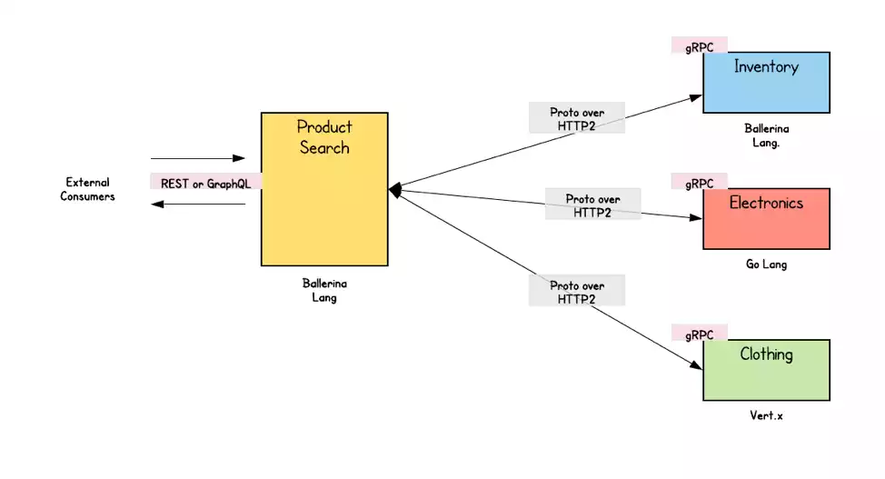

# Onderzoek: De Voordelen van gRPC in Microservice-Architecturen

## Inleiding
In de wereld van softwareontwikkeling zijn microservices een populaire architecturale stijl geworden. Deze aanpak maakt het mogelijk om complexe applicaties te bouwen door ze op te splitsen in kleinere, onafhankelijke diensten. Maar hoe communiceren deze microservices met elkaar? Hier komt gRPC om de hoek kijken. Deze blog verkent de voordelen van gRPC binnen microservice-architecturen in vergelijking met andere communicatiestandaarden, zoals REST.

## Wat is gRPC?
gRPC, ontwikkeld door Google, is een modern open-source framework voor Remote Procedure Calls (RPC). Het is ontworpen om efficiënte communicatie tussen gedistribueerde systemen mogelijk te maken, waarbij het gebruik maakt van Protocol Buffers (protobuf) als interface-definitietaal. gRPC ondersteunt meerdere programmeertalen, waardoor het een veelzijdige keuze is voor ontwikkelaars.

### Wie Gebruikt gRPC en Waarom?
Steeds meer bedrijven stappen over op gRPC. Organisaties zoals Square en Netflix hebben al de voordelen van gRPC omarmd en hebben hun eigen systemen aangepast om gebruik te maken van deze technologie. Ze benadrukken de verbeterde prestaties, de eenvoud van integratie en de mogelijkheid om complexe systemen te beheren.

Figuur 1: <ins>Netflix company integrates gRPC</ins>.

### Kenmerken van gRPC
Een van de grootste voordelen van gRPC is de hoge prestaties die het biedt. Door gebruik te maken van HTTP/2 kunnen ontwikkelaars profiteren van multiplexing, server push en efficiënte connectiebeheer. Bovendien maakt het gRPC mogelijk om verschillende communicatiestijlen te ondersteunen, waaronder eenvoudige aanroepen en bidirectionele streaming.

### Toepassingen van gRPC
gRPC is bij uitstek geschikt voor microservices-architecturen, waar verschillende diensten efficiënt met elkaar moeten communiceren. Het biedt niet alleen lage latentie, maar ook een hoge doorvoer, wat cruciaal is voor toepassingen die real-time gegevensuitwisseling vereisen.

Figuur 2: <ins>Example usage of gRPC in a microservice </ins>.

## gRPC versus REST

Om de voordelen van gRPC volledig te begrijpen, is het belangrijk om te kijken naar de traditionele REST-architectuur. REST (Representational State Transfer) is een populaire stijl voor netwerkgebaseerde applicaties, waarbij gebruik wordt gemaakt van standaard HTTP-methoden. RESTful API's zijn stateless, wat betekent dat elke aanvraag onafhankelijk is en alle benodigde informatie moet bevatten.

### Kernprincipes van REST

REST heeft zijn eigen voordelen, zoals eenvoud en breed gebruik. Het is resource-gebaseerd en maakt gebruik van verschillende dataformaten zoals JSON en XML. Echter, in een microservices-architectuur kan gRPC vaak betere prestaties leveren dan REST, vooral in omgevingen waar snelheid en efficiëntie cruciaal zijn.

### Wat is REST?

REST is de meest populaire architecturale stijl voor het bouwen van API's. In een RESTful architectuur worden resources geïdentificeerd door URI's (Uniform Resource Identifiers), en operaties worden uitgevoerd op die resources met behulp van een standaard set van HTTP-methoden. Resources worden vertegenwoordigd in JSON of XML, die tussen de client en server worden overgedragen in de HTTP-verzoeken en -antwoorden.

### Belangrijke overeenkomsten: gRPC vs. REST

- **Client/server-architectuur**: Beide gRPC en REST volgen de client-serverarchitectuur, waarbij clients verzoeken verzenden en servers reageren door gegevens te retourneren of acties uit te voeren.
- **Gebruik van HTTP**: gRPC en REST gebruiken beide HTTP als hun onderliggende transportprotocol. REST maakt gebruik van HTTP/1.1, terwijl gRPC HTTP/2 gebruikt.
- **Ondersteuning voor meerdere programmeertalen**: Zowel gRPC als REST zijn taalagnostisch, wat betekent dat clients en servers in verschillende programmeertalen kunnen worden geïmplementeerd.
- **Statelessness**: Beide gRPC en REST zijn ontworpen om stateless te zijn, wat betekent dat elke aanvraag alle informatie bevat die de server nodig heeft om deze te verwerken.

### Belangrijkste verschillen: gRPC vs. REST

Hoewel gRPC en REST verschillende fundamenten delen, verschillen ze sterk in hun architectonisch ontwerp en implementatiedetails. De belangrijkste verschillen zijn:

1. **Gegevensformaat**: REST gebruikt meestal tekstgebaseerde formaten zoals JSON en XML, terwijl gRPC Protobuf gebruikt om gegevens in een binair formaat te coderen. Dit maakt gRPC efficiënter in dataverkeer.

2. **Gegevensvalidatie**: Met gRPC definieert de ontwikkelaar service- en berichttypes met Protobuf, wat automatische validatie van berichten mogelijk maakt. REST vereist extra validatiestappen, wat meer verwerkingstijd kost.

3. **Communicatiepatroon**: REST volgt een eenmalige aanvraag/antwoord-cyclus, terwijl gRPC verschillende communicatiepatronen ondersteunt, waaronder serverstreaming, clientstreaming en bidirectionele streaming, dankzij HTTP/2.

4. **Ontwerppatroon**: gRPC APIs definiëren oproepbare functies op de server, terwijl REST APIs een resource-georiënteerd ontwerp hebben, waarbij standaard HTTP-methoden worden gebruikt om toegang te krijgen tot resources via specifieke API-eindpunten.

5. **Codegeneratie**: gRPC's gebruik van Protobuf ondersteunt codegeneratie in verschillende programmeertalen, wat een efficiënter ontwikkelproces mogelijk maakt. REST biedt deze native ondersteuning niet.

### Wanneer gRPC vs. REST gebruiken?

REST is de meest gebruikte API-architectuur vandaag de dag. Het is eenvoudiger om mee te werken en te leren dan gRPC, en het is compatibel met de meeste programmeertalen en platforms. REST is de ideale keuze voor het creëren van een openbare API.

gRPC is daarentegen beter geschikt voor microservices-architecturen, waar hoge efficiëntie, lage latentie en ondersteuning voor verschillende programmeertalen vereist zijn. gRPC is de betere keuze voor toepassingen die real-time interacties vereisen, zoals chat- en video-applicaties, vanwege zijn bi-directionele streamingcapaciteiten en efficiënte gegevensverwerking.

Met deze inzichten in de verschillen en overeenkomsten tussen gRPC en REST, kun je een weloverwogen keuze maken over welke technologie het beste past bij jouw specifieke gebruiksscenario's en vereisten.

### Waarom gRPC voor Microservices Communicatie?
Om de beperkingen die vaak worden aangetroffen in RESTful diensten aan te pakken, is er een groeiende behoefte aan een modern inter-process communicatiesysteem dat schaalbaarheid en superieure efficiëntie biedt. Hier komt gRPC om de hoek kijken, een geavanceerd open-source RPC-framework.

Het gRPC-framework maakt gebruik van een binair coderingsformaat genaamd Protocol Buffers en opereert bovenop HTTP/2. Het biedt sterke typing, ondersteunt meerdere programmeertalen en faciliteert bidirectionele streaming voor zowel client- als serverzijde. Dit maakt gRPC bijzonder effectief voor het bouwen van robuuste microservice-architecturen die hoge prestaties en schaalbaarheid vereisen.

De combinatie van hoge prestaties, lage latentie en krachtige communicatie mogelijkheden maakt gRPC een uitstekende keuze voor moderne microservices-architecturen. Door de overstap naar gRPC kunnen organisaties profiteren van snellere, efficiëntere en schaalbare systemen die beter zijn afgestemd op de eisen van hedendaagse applicaties.

## De Voordelen van gRPC in Microservices

Nu we een basisbegrip hebben van gRPC en REST, laten we eens kijken naar de specifieke voordelen die gRPC biedt in microservice-architecturen.

### Verbetering van Prestaties
gRPC maakt gebruik van multiplexing, waardoor meerdere verzoeken en antwoorden gelijktijdig over dezelfde verbinding kunnen worden verzonden. Dit vermindert de overhead van het openen en sluiten van verbindingen, wat resulteert in snellere communicatie. Dit is vooral waardevol in omgevingen waar veel microservices met elkaar moeten communiceren.

### Lage Latentie
Bovendien is gRPC geoptimaliseerd voor lage latentie, wat het bijzonder geschikt maakt voor toepassingen die real-time interacties vereisen. Dit is vooral waardevol in cloud-gebaseerde architecturen waar verschillende microservices met elkaar moeten communiceren.

### Microservices Inter-process Communicatie
In een op microservices gebaseerde software-architectuur is inter-process communicatie essentieel voor het uitwisselen van informatie. Microservices kunnen met elkaar communiceren via twee primaire communicatie mechanismen:

- **Synchronous Communication (Request-Reply)**: In deze modus initieert één service de communicatie door een API aan te roepen die door een andere service wordt aangeboden en wacht vervolgens op een antwoord. Voor effectief gebruik moet de API goed gedefinieerde semantiek hebben en versiebeheer ondersteunen.
  
- **Asynchronous Communication**: In tegenstelling tot synchronisatie, houdt asynchrone communicatie in dat een service een bericht verzendt zonder een onmiddellijke reactie te verwachten. Meerdere services kunnen deze berichten potentieel afhandelen en verwerken.

## Conclusie
gRPC biedt aanzienlijke voordelen binnen microservice-architecturen, met name op het gebied van prestaties en efficiëntie. Dankzij de ondersteuning voor binaire communicatie via Protocol Buffers, en de voordelen van HTTP/2 zoals multiplexing en bidirectionele streaming, stelt gRPC ontwikkelaars in staat om systemen te bouwen die sneller en schaalbaarder zijn dan traditionele REST-oplossingen. Hoewel REST een bewezen en populaire keuze blijft, laat gRPC zien dat het, vooral in omgevingen waar lage latentie en hoge doorvoer essentieel zijn, een krachtig alternatief biedt. Voor moderne microservices-architecturen, waar snelle en efficiënte communicatie cruciaal is, is gRPC vaak de betere keuze.## gRPC versus REST

Voor wie geïnteresseerd is in de technische details en meer over gRPC wil leren, is de [gRPC Motivation and Design Principles](https://grpc.io/docs/guides/motivation/) een uitstekende bron.

Als je meer wilt weten over de specifieke toepassingen van gRPC in microservices, bekijk dan deze [link](https://www.linkedin.com/pulse/microservices-communication-using-grpc-protocol-prabhat-pankaj).

